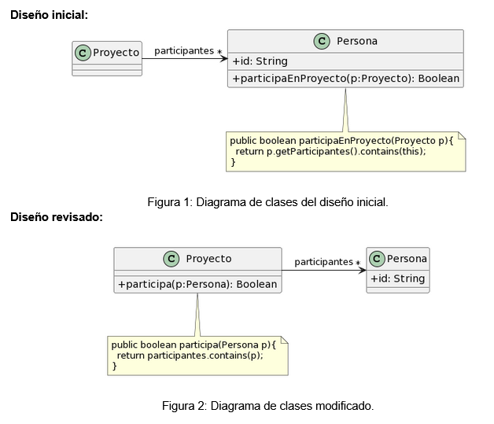

# 1.2 Participación en proyectos 

Al revisar el siguiente diseño inicial (Figura 1), se decidió realizar un cambio para evitar lo que se consideraba un mal olor. El diseño modificado se muestra en la Figura 2. Indique qué tipo de cambio se realizó y si lo considera apropiado. Justifique su respuesta.

 

## Respuesta

Se aplicó correctamente el refactoring <i>Move Method</i> sobre el método `participaEnProyecto(p:Proyecto)` de la clase `Persona` debido a que usaba los atributos de la clase `Proyecto` para determinar la participación. Eso es un indicador de que la responsabilidad está mal asignada. Esto generaba el code smell <i>Feature Envy</i>. 

