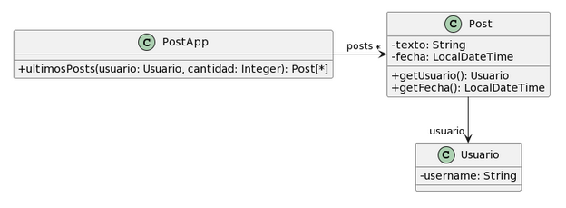

# Ejercicio 6.3 Publicaciones
Realice en forma iterativa los siguientes pasos:
* (i) indique el mal olor,
* (ii) indique el refactoring que lo corrige, 
* (iii) aplique el refactoring, mostrando el resultado final (código y/o diseño según corresponda). 

Si vuelve a encontrar un mal olor, retorne al paso (i).

<div align="center">

</div>

```java
public class PostApp {

    private List<Post> posts; 
    
    /**
    * Retorna los últimos N posts que no pertenecen al usuario user
    */
    public List<Post> ultimosPosts(Usuario user, int cantidad) {
            
        List<Post> postsOtrosUsuarios = new ArrayList<Post>();
        for (Post post : this.posts) {
            if (!post.getUsuario().equals(user)) {
                postsOtrosUsuarios.add(post);
            }
        }
         
       // ordena los posts por fecha
       for (int i = 0; i < postsOtrosUsuarios.size(); i++) {
           int masNuevo = i;
           for(int j= i +1; j < postsOtrosUsuarios.size(); j++) {
               if (postsOtrosUsuarios.get(j).getFecha().isAfter(
         postsOtrosUsuarios.get(masNuevo).getFecha())) {
                  masNuevo = j;
               }    
           }
          Post unPost = postsOtrosUsuarios.set(i,postsOtrosUsuarios.get(masNuevo));
          postsOtrosUsuarios.set(masNuevo, unPost);    
       }
            
        List<Post> ultimosPosts = new ArrayList<Post>();
        int index = 0;
        Iterator<Post> postIterator = postsOtrosUsuarios.iterator();
        while (postIterator.hasNext() &&  index < cantidad) {
            ultimosPosts.add(postIterator.next());
        }
        return ultimosPosts;
    }

}
```
```java
public class Post {

    private String texto;
    private LocalDateTime fecha; 
    
    public String getTexto() {
        return this.texto;
    }

    public LocalDateTime getFecha() {
        return this.fecha; 
    }

}
```
```java
public class Usuario {

    private String username; 

}
```

## Resolución

* ### Feature Envy
    El método accede a las variables de instancia de la clase `Post` para filtrar los posts que no pertenecen al usuario pasado por parámetro. Aplico `Extract Method`? para separar la lógica de filtrado y luego `Move Method` para pasar el nuevo método a la clase `Post`.

```java
public class PostApp {
    
    private List<Post> posts; 
    
    /**
    * Retorna los últimos N posts que no pertenecen al usuario user
    */
    public List<Post> ultimosPosts(Usuario user, int cantidad) {
            
        List<Post> postsOtrosUsuarios = new ArrayList<Post>();
        for (Post post : this.posts) {
            if (!post.perteneceAUsuario(user)) {
                postsOtrosUsuarios.add(post);
            }
        }
         
       // ordena los posts por fecha
       for (int i = 0; i < postsOtrosUsuarios.size(); i++) {
           int masNuevo = i;
           for(int j= i +1; j < postsOtrosUsuarios.size(); j++) {
               if (postsOtrosUsuarios.get(j).getFecha().isAfter(
         postsOtrosUsuarios.get(masNuevo).getFecha())) {
                  masNuevo = j;
               }    
           }
          Post unPost = postsOtrosUsuarios.set(i,postsOtrosUsuarios.get(masNuevo));
          postsOtrosUsuarios.set(masNuevo, unPost);    
       }
            
        List<Post> ultimosPosts = new ArrayList<Post>();
        int index = 0;
        Iterator<Post> postIterator = postsOtrosUsuarios.iterator();
        while (postIterator.hasNext() &&  index < cantidad) {
            ultimosPosts.add(postIterator.next());
        }
        return ultimosPosts;
    }
}
```
```java
public class Post {

    private String texto;
    private LocalDateTime fecha; 
    private Usuario usuario; 
    
    public Usuario getUsuario() {
        return this.usuario;
    }

    public LocalDateTime getFecha() {
        return this.fecha; 
    }

    public boolean perteneceAUsuario(Usuario user, Post post) {
            return (post.getUsuario().equals(user));
    }

}
```
```java
public class Usuario {

    private String username; 

}
```

* ### Imperative Loops
    El filtrado de posts en la clase `PostApp` se puede simplificar haciendo uso de streams(). Aplico `Replace Loop with Pipeline` para solucionarlo.

```java
public class PostApp {
    
    private List<Post> posts; 
    
    /**
    * Retorna los últimos N posts que no pertenecen al usuario user
    */
    public List<Post> ultimosPosts(Usuario user, int cantidad) {
            
        List<Post> postsOtrosUsuarios = new ArrayList<Post>();
        postsOtrosUsuarios = posts.stream()
        .filter(post -> !post.perteneceAUsuario(user))
        .collect(Collectors.ToList());
         
       // ordena los posts por fecha
       for (int i = 0; i < postsOtrosUsuarios.size(); i++) {
           int masNuevo = i;
           for(int j= i +1; j < postsOtrosUsuarios.size(); j++) {
               if (postsOtrosUsuarios.get(j).getFecha().isAfter(
         postsOtrosUsuarios.get(masNuevo).getFecha())) {
                  masNuevo = j;
               }    
           }
          Post unPost = postsOtrosUsuarios.set(i,postsOtrosUsuarios.get(masNuevo));
          postsOtrosUsuarios.set(masNuevo, unPost);    
       }
            
        List<Post> ultimosPosts = new ArrayList<Post>();
        int index = 0;
        Iterator<Post> postIterator = postsOtrosUsuarios.iterator();
        while (postIterator.hasNext() &&  index < cantidad) {
            ultimosPosts.add(postIterator.next());
        }
        return ultimosPosts;
    }
}
```
```java
public class Post {

    private String texto;
    private LocalDateTime fecha; 
    private Usuario usuario; 
    
    public Usuario getUsuario() {
        return this.usuario;
    }

    public LocalDateTime getFecha() {
        return this.fecha; 
    }

    public boolean perteneceAUsuario(Usuario user) {
            return (post.getUsuario().equals(user));
    }

}
```
```java
public class Usuario {

    private String username; 

}
```

* ### Long Method.
    El método `ultimosPosts()` realiza muchas tareas y sería mejor descomponerlo en métodos más cortos y específicos. Aplico `Extract Method` para solucionarlo.

```java
public class PostApp {
    
    private List<Post> posts; 
    
    /**
    * Retorna los últimos N posts que no pertenecen al usuario user
    */
    public List<Post> ultimosPosts(Usuario user, int cantidad) {
            
        List<Post> postsOtrosUsuarios = obtenerPostsOtrosUsuarios(user);
         
        ordenarPosts(postsOtrosUsuarios);
            
        List<Post> ultimosPosts = obtenerNPosts(postsOtrosUsuarios, cantidad);
        return ultimosPosts; 

    }

    private List<Post> obtenerPostsOtrosUsuarios(Usuario user) {
        
        return posts.stream()
        .filter(post -> !post.perteneceAUsuario(user))
        .collect(Collectors.ToList());
    
    }

    private void ordenarPosts(List<Post> postsOtrosUsuarios) {
        
        for (int i = 0; i < postsOtrosUsuarios.size(); i++) {
           int masNuevo = i;
           for(int j= i +1; j < postsOtrosUsuarios.size(); j++) {
               if (postsOtrosUsuarios.get(j).getFecha().isAfter(
         postsOtrosUsuarios.get(masNuevo).getFecha())) {
                  masNuevo = j;
               }    
           }
          Post unPost = postsOtrosUsuarios.set(i,postsOtrosUsuarios.get(masNuevo));
          postsOtrosUsuarios.set(masNuevo, unPost);    
       }

    }

    private List<Post> obtenerNPosts(List<Post> posts, int n) {
        
        List<Post> ultimosPosts = new ArrayList<Post>();
        int index = 0;
        Iterator<Post> postIterator = postsOtrosUsuarios.iterator();
        while (postIterator.hasNext() &&  index < cantidad) {
            ultimosPosts.add(postIterator.next());
        }
        return ultimosPosts;

    }
}
```
```java
public class Post {

    private String texto;
    private LocalDateTime fecha; 
    private Usuario usuario; 
    
    public Usuario getUsuario() {
        return this.usuario;
    }

    public LocalDateTime getFecha() {
        return this.fecha; 
    }

    public boolean perteneceAUsuario(Usuario user) {
            return (post.getUsuario().equals(user));
    }

}
```
```java
public class Usuario {

    private String username; 

}
```

* ### Imperative Loops
    El método para ordenar posts y obtener los últimos N posts en la clase `PostApp` se pueden simplificar haciendo uso de streams(). Aplico `Replace Loop with Pipeline` para solucionarlo.

```java
public class PostApp {
    
    private List<Post> posts; 
    
    /**
    * Retorna los últimos N posts que no pertenecen al usuario user
    */
    public List<Post> ultimosPosts(Usuario user, int cantidad) {
            
        List<Post> postsOtrosUsuarios = obtenerPostsOtrosUsuarios(user);
         
        postsOtrosUsuarios = ordenarPosts(postsOtrosUsuarios);
            
        postsOtrosUsuarios = obtenerNPosts(postsOtrosUsuarios, cantidad);
        return postsOtrosUsuarios; 

    }

    private List<Post> obtenerPostsOtrosUsuarios(Usuario user) {
        
        return posts.stream()
        .filter(post -> !post.perteneceAUsuario(user))
        .collect(Collectors.ToList());
    
    }

    private void ordenarPosts(List<Post> posts) {
        
        return posts.streams()
        .sorted((post1, post2) -> post2.getFecha().compareTo(post1.getFecha()))
        .collect(Collectors.ToList()); 

    }

    private List<Post> obtenerNPosts(List<Post> posts, int n) {
        
        return posts.stream()
        .limit(n)
        .collect(Collectors.toList());

    }
}
```
```java
public class Post {

    private String texto;
    private LocalDateTime fecha; 
    private Usuario usuario; 
    
    public Usuario getUsuario() {
        return this.usuario;
    }

    public LocalDateTime getFecha() {
        return this.fecha; 
    }

    public boolean perteneceAUsuario(Usuario user) {
            return (post.getUsuario().equals(user));
    }

}
```
```java
public class Usuario {

    private String username; 

}
```

* ### Lazy Class? 
    Debería aplicar Inline Class para llevar el atributo a Post?
