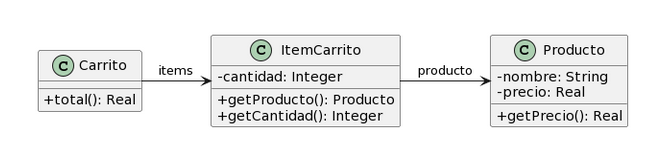

# Ejercicio 6.3 Publicaciones
Realice en forma iterativa los siguientes pasos:
* (i) indique el mal olor,
* (ii) indique el refactoring que lo corrige, 
* (iii) aplique el refactoring, mostrando el resultado final (código y/o diseño según corresponda). 

Si vuelve a encontrar un mal olor, retorne al paso (i).

<div align="center">

</div>

```java
public class Producto {
    private String nombre;
    private double precio;
    
    public double getPrecio() {
        return this.precio;
    }
}
```
```java
public class ItemCarrito {
    private Producto producto;
    private int cantidad;
        
    public Producto getProducto() {
        return this.producto;
    }
    
    public int getCantidad() {
        return this.cantidad;
    }

}
```
```java
public class Carrito {
    private List<ItemCarrito> items;
    
    public double total() {
        return this.items.stream()
        .mapToDouble(item -> 
        item.getProducto().getPrecio() * item.getCantidad())
        .sum();
    }
}
```
## Resolución

* ### Feature Envy
    El método `total()` de la clase `Carrito` opera con las variables de instancia de la clase `Item` lo cual significa que hay una mala asignación de responsabilidades. Aplico `Extract Method` para aislar la parte del código que opera con dichas variables y luego `Move Method` para llevarlo a la clase que almacena los datos.

```java
public class Producto {
    private String nombre;
    private double precio;
    
    public double getPrecio() {
        return this.precio;
    }
}
```
```java
public class ItemCarrito {
    private Producto producto;
    private int cantidad;
        
    public Producto getProducto() {
        return this.producto;
    }
    
    public int getCantidad() {
        return this.cantidad;
    }

    public double obtenerCosto() {
        producto.getPrecio() * item.getCantidad();
    }
}
```
```java
public class Carrito {
    private List<ItemCarrito> items;
    
    public double total() {
        return this.items.stream()
        .mapToDouble(item -> item.obtenerCosto())
        .sum();
    }
}
```

* ### Uncommunicative Name
    El método `total()` de la clase `Carrito` es poco explicativo. Aplico `Rename Method` para solucionarlo.

```java
public class Producto {
    private String nombre;
    private double precio;
    
    public double getPrecio() {
        return this.precio;
    }
}
```
```java
public class ItemCarrito {
    private Producto producto;
    private int cantidad;
        
    public Producto getProducto() {
        return this.producto;
    }
    
    public int getCantidad() {
        return this.cantidad;
    }

    public double obtenerCosto() {
        producto.getPrecio() * item.getCantidad();
    }
}
```
```java
public class Carrito {
    private List<ItemCarrito> items;
    
    public double obtenerCostoTotal() {
        return this.items.stream()
        .mapToDouble(item -> item.obtenerCosto())
        .sum();
    }
}
```

* ### qué pasa con producto?