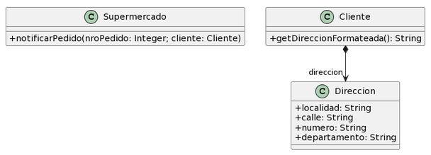

# Ejercicio 6.4 Envio De Paquetes
Realice en forma iterativa los siguientes pasos:
* (i) indique el mal olor,
* (ii) indique el refactoring que lo corrige, 
* (iii) aplique el refactoring, mostrando el resultado final (código y/o diseño según corresponda). 

Si vuelve a encontrar un mal olor, retorne al paso (i).

<div>

</div>

```java
public class Supermercado {
   public void notificarPedido(long nroPedido, Cliente cliente) {
        String notificacion = MessageFormat.format(“Estimado cliente, se le informa que hemos recibido su pedido con número {0}, el cual será enviado a la dirección {1}”, new Object[] { nroPedido, cliente.getDireccionFormateada() });

        // lo imprimimos en pantalla, podría ser un mail, SMS, etc..
        System.out.println(notificacion);
  }
}
``` 
```java
public class Cliente {
    public String getDireccionFormateada() {
        return 
            this.direccion.getLocalidad() + “, ” +
            this.direccion.getCalle() + “, ” +
            this.direccion.getNumero() + “, ” +
            this.direccion.getDepartamento();
    }
}
```
```java
public class Direccion {
    public String localidad; 
    public String calle;
    public String numero; 
    public String departamento; 

    public String getLocalidad() {
        return this.localidad;
    }

    public String getCalle() {
        return this.calle;
    }

    public String getNumero() {
        return this.numero;
    }

    public String getDepartamento() {
        return this.departamento;
    }
}
```

## Resolución

* ### Comments
    El método `notificarPedido()` de la clase `Supermercado` posee un comentario para indicar que se imprime la notificación. Aplico `Extract Method` para solucionarlo.

```java
public class Supermercado {
   public void notificarPedido(long nroPedido, Cliente cliente) {
        String notificacion = MessageFormat.format(“Estimado cliente, se le informa 
        que hemos recibido su pedido con número {0}, el cual será enviado a la dirección 
        {1}”, new Object[] { nroPedido, cliente.getDireccionFormateada() });

        imprimirNotificacion(notificacion);    
  }

  public void imprimirNotificacion(String notificacion) {
        System.out.println(notificacion);
  }
}
```

* ### Feature Envy
    La clase `Cliente` presenta envidia de atributos debido a que opera con las variables de instancia de la clase Direccion. Aplico `Move Method` para solucionarlo. Aplico `Add Parameter` en el método `notificarPedido()` de la clase `Supermercado` para poder realizar la llamada necesaria al método `getDireccionFormateada()` de la clase `Direccion`.

```java
public class Supermercado {
   public void notificarPedido(long nroPedido, Cliente cliente, Direccion direccion) {
        String notificacion = MessageFormat.format(“Estimado cliente, se le informa 
        que hemos recibido su pedido con número {0}, el cual será enviado a la dirección 
        {1}”, new Object[] { nroPedido, direccion.getDireccionFormateada() });

        imprimirNotificacion(notificacion);    
    }

    public void imprimirNotificacion(String notificacion) {
        System.out.println(notificacion);
    }
}
```
```java
public class Cliente {
    
}
```
```java
public class Direccion {
    public String localidad; 
    public String calle;
    public String numero; 
    public String departamento; 

    public String getLocalidad() {
        return this.localidad;
    }

    public String getCalle() {
        return this.calle;
    }

    public String getNumero() {
        return this.numero;
    }

    public String getDepartamento() {
        return this.departamento;
    }

    public String getDireccionFormateada() {
        return 
            this.localidad + “, ” +
            this.calle + “, ” +
            this.numero + “, ” +
            this.departamento;
    }
}
```

* ### Dead Code
    La clase `Cliente` no tiene estado ni comportamiento propios. Para solucionar esto simplemente la eliminamos. 

```java
public class Supermercado {
   public void notificarPedido(long nroPedido, Cliente cliente, Direccion direccion) {
        String notificacion = MessageFormat.format(“Estimado cliente, se le informa 
        que hemos recibido su pedido con número {0}, el cual será enviado a la dirección 
        {1}”, new Object[] { nroPedido, direccion.getDireccionFormateada() });

        imprimirNotificacion(notificacion);    
    }

    public void imprimirNotificacion(String notificacion) {
        System.out.println(notificacion);
    }
}
```
```java
public class Direccion {
    public String localidad; 
    public String calle;
    public String numero; 
    public String departamento; 

    public String getLocalidad() {
        return this.localidad;
    }

    public String getCalle() {
        return this.calle;
    }

    public String getNumero() {
        return this.numero;
    }

    public String getDepartamento() {
        return this.departamento;
    }

    public String getDireccionFormateada() {
        return 
            this.localidad + “, ” +
            this.calle + “, ” +
            this.numero + “, ” +
            this.departamento;
    }
}
```

* ### Dead Code
    El método `notificarPedido()` de la clase `Supermercado` tiene un parámetro de tipo `Cliente` que es una clase que no existe más. Para solucionarlo aplicamos `Remove Parameter`.

```java
public class Supermercado {
   public void notificarPedido(long nroPedido, Direccion direccion) {
        String notificacion = MessageFormat.format(“Estimado cliente, se le informa 
        que hemos recibido su pedido con número {0}, el cual será enviado a la dirección 
        {1}”, new Object[] { nroPedido, direccion.getDireccionFormateada() });

        imprimirNotificacion(notificacion);    
    }

    public void imprimirNotificacion(String notificacion) {
        System.out.println(notificacion);
    }
}
```
```java
public class Direccion {
    public String localidad; 
    public String calle;
    public String numero; 
    public String departamento; 

    public String getLocalidad() {
        return this.localidad;
    }

    public String getCalle() {
        return this.calle;
    }

    public String getNumero() {
        return this.numero;
    }

    public String getDepartamento() {
        return this.departamento;
    }

    public String getDireccionFormateada() {
        return 
            this.localidad + “, ” +
            this.calle + “, ” +
            this.numero + “, ” +
            this.departamento;
    }
}
```