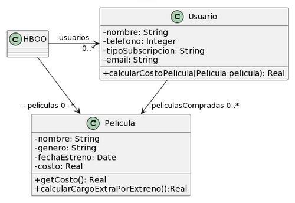

# Ejercicio 6.5 Películas
Realice en forma iterativa los siguientes pasos:
* (i) indique el mal olor,
* (ii) indique el refactoring que lo corrige, 
* (iii) aplique el refactoring, mostrando el resultado final (código y/o diseño según corresponda). 

Si vuelve a encontrar un mal olor, retorne al paso (i).

<div align="center">

</div>

```java
public class Usuario {
    String tipoSubscripcion;
    // ...

    public void setTipoSubscripcion(String unTipo) {
   	    this.tipoSubscripcion = unTipo;
    }
    
    public double calcularCostoPelicula(Pelicula pelicula) {
        double costo = 0;
        if (tipoSubscripcion =="Basico") {
            costo = pelicula.getCosto() + pelicula.calcularCargoExtraPorEstreno();
        }
        else if (tipoSubscripcion == "Familia") {
            costo = (pelicula.getCosto() + pelicula.calcularCargoExtraPorEstreno()) * 0.90;
        }
        else if (tipoSubscripcion =="Plus") {
            costo = pelicula.getCosto();
        }
        else if (tipoSubscripcion =="Premium") {
            costo = pelicula.getCosto() * 0.75;
        }
        return costo;
    }
}
```
```java
public class Pelicula {
    LocalDate fechaEstreno;
    // ...

    public double getCosto() {
   	 return this.costo;
    }
    
    public double calcularCargoExtraPorEstreno(){
	// Si la Película se estrenó 30 días antes de la fecha actual, retorna un cargo de 0$, caso contrario, retorna un cargo extra de 300$
   	return (ChronoUnit.DAYS.between(this.fechaEstreno, LocalDate.now()) ) > 30 ? 0 : 300;
    }
}
```

## Resolución

* ### Feature Envy
    El método `calcularCostoPelicula()` de la clase `Usuario` accede a variables de instancia y métodos de la clase `Pelicula`, lo cual denota responsabilidades mal asignadas. Utilizo `Extract Method` para aislar el fragmento de código que opera de esta manera y `Move Method` para moverlo a la clase `Pelicula`. 

```java
public class Usuario {
    String tipoSubscripcion;
    // ...

    public void setTipoSubscripcion(String unTipo) {
   	    this.tipoSubscripcion = unTipo;
    }
    
    public double calcularCostoPelicula(Pelicula pelicula) {
        double costo = 0;
        if (tipoSubscripcion =="Basico") {
            costo = pelicula.calcularCosto();
        }
        else if (tipoSubscripcion == "Familia") {
            costo = pelicula.calcularCosto() * 0.90;
        }
        else if (tipoSubscripcion =="Plus") {
            costo = pelicula.getCosto();
        }
        else if (tipoSubscripcion =="Premium") {
            costo = pelicula.getCosto() * 0.75;
        }
        return costo;
    }
}
```
```java
public class Pelicula {
    private LocalDate fechaEstreno;
    private String nombre; 
    private String genero; 
    private double costo; 

    public double getCosto() {
   	 return this.costo;
    }
    
    public double calcularCargoExtraPorEstreno(){
	// Si la Película se estrenó 30 días antes de la fecha actual, retorna un cargo de 0$, caso contrario, retorna un cargo extra de 300$
   	return (ChronoUnit.DAYS.between(this.fechaEstreno, LocalDate.now()) ) > 30 ? 0 : 300;
    }

    public double calcularCostoConCargoExtra() {
        return costo + calcularCargoExtraPorEstreno();
    }
}
```

* ### Switch Statements
    El método `calcularCostoPelicula()` de la clase `Usuario` tiene condicionales (if-else) que operan sobre el tipo de una variable. Para solucionarlo aplico `Replace Conditional with Polymorphism`. 

```java
public class Usuario {
    Subscripcion subscripcion;
    // ...

    public void setTipoSubscripcion(Subscripcion subscripcion) {
   	    this.subscripcion = subscripcion;
    }
    
    public double calcularCostoPelicula(Pelicula pelicula) {
        // * * REPLACE TEMP WITH QUERY?
        double costo = subscripcion.calcularCosto(pelicula);
        return costo; 
    }
}
```
```java
public interface Subscripcion {
    public double calcularCosto(Pelicula pelicula);
}
```
```java
public class SubscripcionBasica {

    public double calcularCosto(Pelicula pelicula) {
        return pelicula.calcularCostoConCargoExtra(); 
    }

}
```
```java
public class SubscripcionFamiliar {

    public double calcularCosto(Pelicula pelicula) {
        return pelicula.calcularCostoConCargoExtra() * 0.90; 
    }

}
```
```java
public class SubscripcionPlus {

    public double calcularCosto(Pelicula pelicula) {
        return pelicula.getCosto();
    }

}
```
```java
public class SubscripcionPremium {

    public double calcularCosto(Pelicula pelicula) {
        return pelicula.getCosto() * 0.75;
    }

}
```

* ### Comments
    El comentario en el método `calcularCargoExtraPorEstreno()` de la clase `Pelicula` se puede eliminar aplicando `Extract Method` para crear un método que calcule hace cuánto se estrenó una película y esté nombrado adecuadamente.

```java
public class Usuario {
    Subscripcion subscripcion;
    // ...

    public void setTipoSubscripcion(Subscripcion subscripcion) {
   	    this.subscripcion = subscripcion;
    }
    
    public double calcularCostoPelicula(Pelicula pelicula) {
        // * * REPLACE TEMP WITH QUERY?
        double costo = subscripcion.calcularCosto(pelicula);
        return costo; 
    }
}
```
```java
public interface Subscripcion {
    public double calcularCosto(Pelicula pelicula);
}
```
```java
public class SubscripcionBasica {

    public double calcularCosto(Pelicula pelicula) {
        return pelicula.calcularCostoConCargoExtra(); 
    }

}
```
```java
public class SubscripcionFamiliar {

    public double calcularCosto(Pelicula pelicula) {
        return pelicula.calcularCostoConCargoExtra() * 0.90; 
    }

}
```
```java
public class SubscripcionPlus {

    public double calcularCosto(Pelicula pelicula) {
        return pelicula.getCosto();
    }

}
```
```java
public class SubscripcionPremium {

    public double calcularCosto(Pelicula pelicula) {
        return pelicula.getCosto() * 0.75;
    }

}
```
```java
public class Pelicula {
    private LocalDate fechaEstreno;
    private String nombre; 
    private String genero; 
    private double costo; 

    public double getCosto() {
   	 return this.costo;
    }
    
    public double calcularCargoExtraPorEstreno(){
   	return (calcularDiasDesdeEstreno()) > 30 ? 0 : 300;
    }

    public int calcularDiasDesdeEstreno() {
        return (ChronoUnit.DAYS.between(this.fechaEstreno, LocalDate.now()));
    }

    public double calcularCostoConCargoExtra() {
        return costo + calcularCargoExtraPorEstreno();
    }
}
```