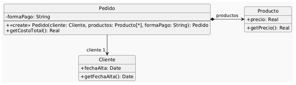
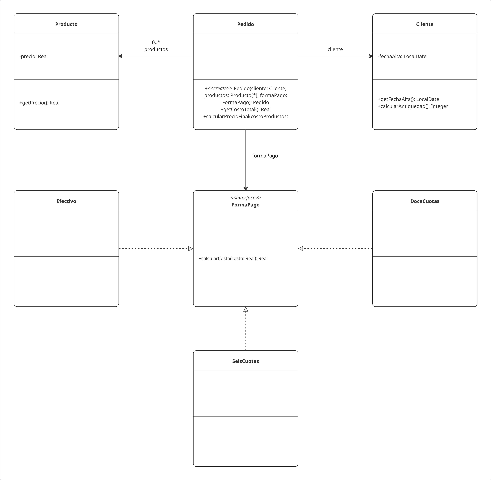

# Ejercicio 9 - Pedidos

Se tiene el siguiente modelo de un sistema de pedidos y la correspondiente implementación.

<div align="center">

</div>

```java
01: public class Pedido {
02:     private Cliente cliente;
03:     private List<Producto> productos;
04:     private String formaPago;
05:
06:     public Pedido(Cliente cliente, List<Producto> productos, String formaPago){
07:         if (!"efectivo".equals(formaPago)
08:         && !"6 cuotas".equals(formaPago)
09:         && !"12 cuotas".equals(formaPago)) {
10:             throw new Error("Forma de pago incorrecta");
11:         }
12:         this.cliente = cliente;
13:         this.productos = productos;
14:         this.formaPago = formaPago;
15:     }
16:
17:     public double getCostoTotal() {
18:         double costoProductos = 0;
19:         for (Producto producto : this.productos) {
20:             costoProductos += producto.getPrecio();
21:         }
22:         double extraFormaPago = 0;
23:         if ("efectivo".equals(this.formaPago)) {
24:             extraFormaPago = 0;
25:         } else if ("6 cuotas".equals(this.formaPago)) {
26:             extraFormaPago = costoProductos * 0.2;
27:         } else if ("12 cuotas".equals(this.formaPago)) {
28:             extraFormaPago = costoProductos * 0.5;
29:         }
30:         int añosDesdeFechaAlta = Period.between(this.cliente.getFechaAlta(),LocalDate.now()).getYears();
31:         // Aplicar descuento del 10% si el cliente tiene más de 5 años de antiguedad
32:         if (añosDesdeFechaAlta > 5) {
33:             return (costoProductos + extraFormaPago) * 0.9;
34:         }
35:         return costoProductos + extraFormaPago;
36:     }
37: }
38:
39: public class Cliente {
40:     private LocalDate fechaAlta;
41:
42:     public LocalDate getFechaAlta() {
43:         return this.fechaAlta;
44:     }
45: }
46:
47: public class Producto {
48:     private double precio;
49:
50:     public double getPrecio() {
51:         return this.precio;
52:     }
53: }
```

### Tareas

Dado el código anterior, aplique únicamente los siguientes refactoring:

    1. Replace Loop with Pipeline (líneas 16 a 19)
    2. Replace Conditional with Polymorphism (líneas 21 a 27)
    3. Extract method y move method (línea 28)
    4. Extract method y replace temp with query (líneas 28 a 33)

Realice el diagrama de clases del código refactorizado.

#### Replace Loop with Pipeline (líneas 16 a 18)

```java
01: public class Pedido {
02:     private Cliente cliente;
03:     private List<Producto> productos;
04:     private String formaPago;
05:
06:     public Pedido(Cliente cliente, List<Producto> productos, String formaPago){
07:         if (!"efectivo".equals(formaPago)
08:         && !"6 cuotas".equals(formaPago)
09:         && !"12 cuotas".equals(formaPago)) {
10:             throw new Error("Forma de pago incorrecta");
11:         }
12:         this.cliente = cliente;
13:         this.productos = productos;
14:         this.formaPago = formaPago;
15:     }
16:
17:     public double getCostoTotal() {
18:         double costoProductos = this.productos.stream()
19:             .mapToDouble(producto -> producto.getPrecio())
20:             .sum();
21:
22:         double extraFormaPago = 0;
23:         if ("efectivo".equals(this.formaPago)) {
24:             extraFormaPago = 0;
25:         } else if ("6 cuotas".equals(this.formaPago)) {
26:             extraFormaPago = costoProductos * 0.2;
27:         } else if ("12 cuotas".equals(this.formaPago)) {
28:             extraFormaPago = costoProductos * 0.5;
29:         }
30:         int añosDesdeFechaAlta = Period.between(this.cliente.getFechaAlta(),LocalDate.now()).getYears();
31:         // Aplicar descuento del 10% si el cliente tiene más de 5 años de antiguedad
32:         if (añosDesdeFechaAlta > 5) {
33:             return (costoProductos + extraFormaPago) * 0.9;
34:         }
35:         return costoProductos + extraFormaPago;
36:     }
37: }
38:
39: public class Cliente {
40:     private LocalDate fechaAlta;
41:
42:     public LocalDate getFechaAlta() {
43:         return this.fechaAlta;
44:     }
45: }
46:
47: public class Producto {
48:     private double precio;
49:
50:     public double getPrecio() {
51:         return this.precio;
52:     }
53: }
```

#### Replace Type Code with State/Strategy (líneas )

Este es un paso intermedio para poder aplicar Replace Conditional with Polymorphism

```java
01: public class Pedido {
02:     private Cliente cliente;
03:     private List<Producto> productos;
04:     private FormaPago formaPago;
05:
06:     public Pedido(Cliente cliente, List<Producto> productos, FormaPago formaPago){
07:         this.cliente = cliente;
08:         this.productos = productos;
09:         this.formaPago = formaPago;
10:     }
11:
12:     public String getFormaPago() {
13:         return this.formaPago.getFormaPago();
14:     }
15:
16:     public double getCostoTotal() {
17:         double costoProductos = this.productos.streams()
18:             .mapToDouble(producto -> producto.getPrecio())
19:             .sum();
20:
21:         double extraFormaPago = 0;
22:         if ("efectivo".equals(getFormaPago())) {
23:             extraFormaPago = 0;
24:         } else if ("6 cuotas".equals(getFormaPago())) {
25:             extraFormaPago = costoProductos * 0.2;
26:         } else if ("12 cuotas".equals(getFormaPago())) {
27:             extraFormaPago = costoProductos * 0.5;
28:         }
29:         int añosDesdeFechaAlta = Period.between(this.cliente.getFechaAlta(),LocalDate.now()).getYears();
30:         // Aplicar descuento del 10% si el cliente tiene más de 5 años de antiguedad
31:         if (añosDesdeFechaAlta > 5) {
32:             return (costoProductos + extraFormaPago) * 0.9;
33:         }
34:         return costoProductos + extraFormaPago;
35:     }
36: }
37:
38: public class Cliente {
39:     private LocalDate fechaAlta;
40:
41:     public LocalDate getFechaAlta() {
42:         return this.fechaAlta;
43:     }
44: }
45:
46: public class Producto {
47:     private double precio;
48:
49:     public double getPrecio() {
50:         return this.precio;
51:     }
52: }
53:
54: public interface FormaPago {
55:     public String getFormaPago();
56: }
57:
58: public class Efectivo implements FormaPago {
59:     public String getFormaPago() {
60:         return "efectivo";
61:     }
62: }
63:
64: public class SeisCuotas implements FormaPago {
65:     public String getFormaPago() {
66:         return "6 cuotas";
67:     }
68: }
69:
70: public class 12Cuotas implements FormaPago {
71:     public String getFormaPago() {
72:         return "12 cuotas";
73:     }
74: }
```

#### Replace Conditional with Polymorphism

```java
01: public class Pedido {
02:     private Cliente cliente;
03:     private List<Producto> productos;
04:     private FormaPago formaPago;
05:
06:     public Pedido(Cliente cliente, List<Producto> productos, FormaPago formaPago){
07:         this.cliente = cliente;
08:         this.productos = productos;
09:         this.formaPago = formaPago;
10:     }
11:
12:     public double getCostoTotal() {
13:         double costoProductos = this.productos.streams()
14:             .mapToDouble(producto -> producto.getPrecio())
15:             .sum();
16:
17:         double extraFormaPago = this.formaPago.calcularCosto();
18:         int añosDesdeFechaAlta = Period.between(this.cliente.getFechaAlta(),LocalDate.now()).getYears();
19:         // Aplicar descuento del 10% si el cliente tiene más de 5 años de antiguedad
20:         if (añosDesdeFechaAlta > 5) {
21:             return (costoProductos + extraFormaPago) * 0.9;
22:         }
23:         return costoProductos + extraFormaPago;
24:     }
25: }
26:
27: public class Cliente {
28:     private LocalDate fechaAlta;
29:
30:     public LocalDate getFechaAlta() {
31:         return this.fechaAlta;
32:     }
33: }
34:
35: public class Producto {
36:     private double precio;
37:
38:     public double getPrecio() {
39:         return this.precio;
40:     }
41: }
42:
43: public interface FormaPago {
44:     public double calcularCosto(double costo);
45: }
46:
47: public class Efectivo implements FormaPago {
48:     public double calcularCosto(double costo) {
49:         return 0;
50:     }
51: }
52:
53: public class SeisCuotas implements FormaPago {
54:     public double calcularCosto(double costo) {
55:         return costo * 0.2;
56:     }
57: }
58:
59: public class DoceCuotas implements FormaPago {
60:     public double calcularCosto(double costo) {
61:         return costo * 0.5;
62:     }
63: }
```

Consulta: cuando voy eliminando las ramas del condicional y el método finalmente queda vacío, se elimina teniendo en cuenta que es Dead Code y directamente se hace la llamada al método de la interfaz para asignarlo a extraFormaPago?

#### Extract Method y Move Method

```java
01: public class Pedido {
02:     private Cliente cliente;
03:     private List<Producto> productos;
04:     private FormaPago formaPago;
05:
06:     public Pedido(Cliente cliente, List<Producto> productos, FormaPago formaPago){
07:         this.cliente = cliente;
08:         this.productos = productos;
09:         this.formaPago = formaPago;
10:     }
11:
12:     public double getCostoTotal() {
13:         double costoProductos = this.productos.streams()
14:             .mapToDouble(producto -> producto.getPrecio())
15:             .sum();
16:
17:         double extraFormaPago = this.formaPago.calcularCosto();
18:         int añosDesdeFechaAlta = this.cliente.calcularAntiguedad();
19:         // Aplicar descuento del 10% si el cliente tiene más de 5 años de antiguedad
20:         if (añosDesdeFechaAlta > 5) {
21:             return (costoProductos + extraFormaPago) * 0.9;
22:         }
23:         return costoProductos + extraFormaPago;
24:     }
25: }
26:
27: public class Cliente {
28:     private LocalDate fechaAlta;
29:
30:     public LocalDate getFechaAlta() {
31:         return this.fechaAlta;
32:     }
33:
34:     public int calcularAntiguedad() {
35:         return Period.between(this.fechaAlta,LocalDate.now()).getYears();
36:     }
37: }
38:
39: public class Producto {
40:     private double precio;
41:
42:     public double getPrecio() {
43:         return this.precio;
44:     }
45: }
46:
47: public interface FormaPago {
48:     public double calcularCosto(double costo);
49: }
50:
51: public class Efectivo implements FormaPago {
52:     public double calcularCosto(double costo) {
53:         return 0;
54:     }
55: }
56:
57: public class SeisCuotas implements FormaPago {
58:     public double calcularCosto(double costo) {
59:         return costo * 0.2;
60:     }
61: }
62:
63: public class DoceCuotas implements FormaPago {
64:     public double calcularCosto(double costo) {
65:         return costo * 0.5;
66:     }
67: }
```

#### Extract Method y Replace Temp with Query

```java
01: public class Pedido {
02:     private Cliente cliente;
03:     private List<Producto> productos;
04:     private FormaPago formaPago;
05:
06:     public Pedido(Cliente cliente, List<Producto> productos, FormaPago formaPago){
07:         this.cliente = cliente;
08:         this.productos = productos;
09:         this.formaPago = formaPago;
10:     }
11:
12:     public double getCostoTotal() {
13:         double costoProductos = this.productos.streams()
14:             .mapToDouble(producto -> producto.getPrecio())
15:             .sum();
16:
17:         double extraFormaPago = this.formaPago.calcularCosto();
18:
19:         return calcularPrecioFinal(costoProductos, extraFormaPago);
20:     }
21:
22:     public double calcularPrecioFinal(double costoProductos, double extraFormaPago) {
23:         if (cliente.calcularAntiguedad() > 5) {
24:             return (costoProductos + extraFormaPago) * 0.9;
25:         }
26:         return costoProductos + extraFormaPago;
27:     }
28: }
29:
30: public class Cliente {
31:     private LocalDate fechaAlta;
32:
33:     public LocalDate getFechaAlta() {
34:         return this.fechaAlta;
35:     }
36:
37:     public int calcularAntiguedad() {
38:         return Period.between(this.fechaAlta,LocalDate.now()).getYears();
39:     }
40: }
41:
42: public class Producto {
43:     private double precio;
44:
45:     public double getPrecio() {
46:         return this.precio;
47:     }
48: }
49:
50: public interface FormaPago {
51:     public double calcularCosto(double costo);
52: }
53:
54: public class Efectivo implements FormaPago {
55:     public double calcularCosto(double costo) {
56:         return 0;
57:     }
58: }
59:
60: public class SeisCuotas implements FormaPago {
61:     public double calcularCosto(double costo) {
62:         return costo * 0.2;
63:     }
64: }
65:
66: public class DoceCuotas implements FormaPago {
67:     public double calcularCosto(double costo) {
68:         return costo * 0.5;
69:     }
70: }
```

### Diagrama final

---

<div align="center">

</div>
