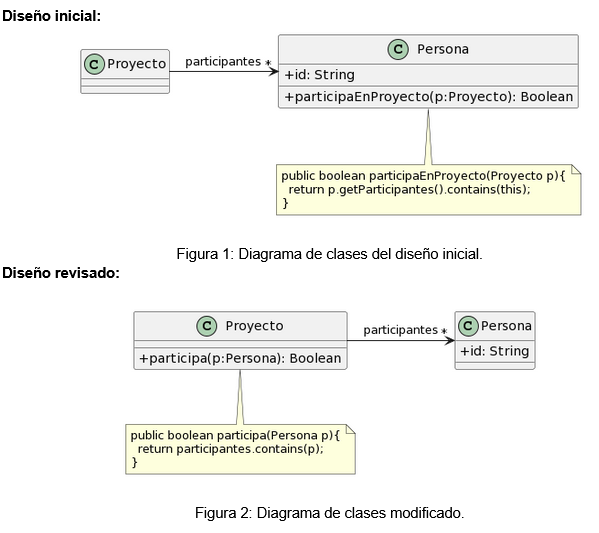

# 1.2	Participación en proyectos.
Al revisar el siguiente diseño inicial (Figura 1), se decidió realizar un cambio para evitar lo que se consideraba un mal olor. El diseño modificado se muestra en la Figura 2. Indique qué tipo de cambio se realizó y si lo considera apropiado. Justifique su respuesta.

<u><i>Code smells</i></u>  
  * Feature Envy.
  * Data Class.
   

En este ejercicio se aplicó el refactoring Move Method de manera adecuada, ya que la clase Persona presentaba envidia de atributos en su método participaEnProyecto(p: Proyecto) y la clase Proyecto no tenía comportamiento propio. El objetivo principal del paradigma de programación orientada a objetos es que se puedan encapsular datos junto con los procesos que utilizan los mismos. Por eso lo ideal es que la clase Proyecto consulte a sus datos internos (en este caso los participantes del mismo).
