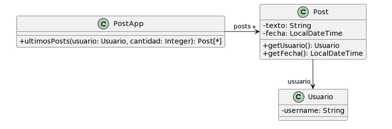
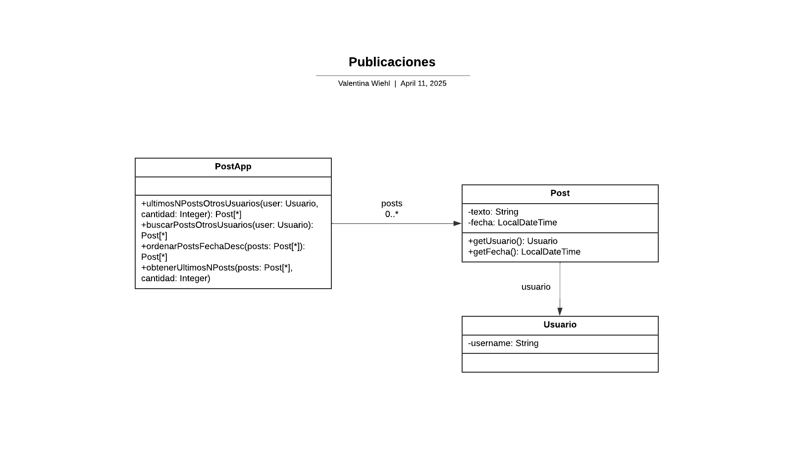
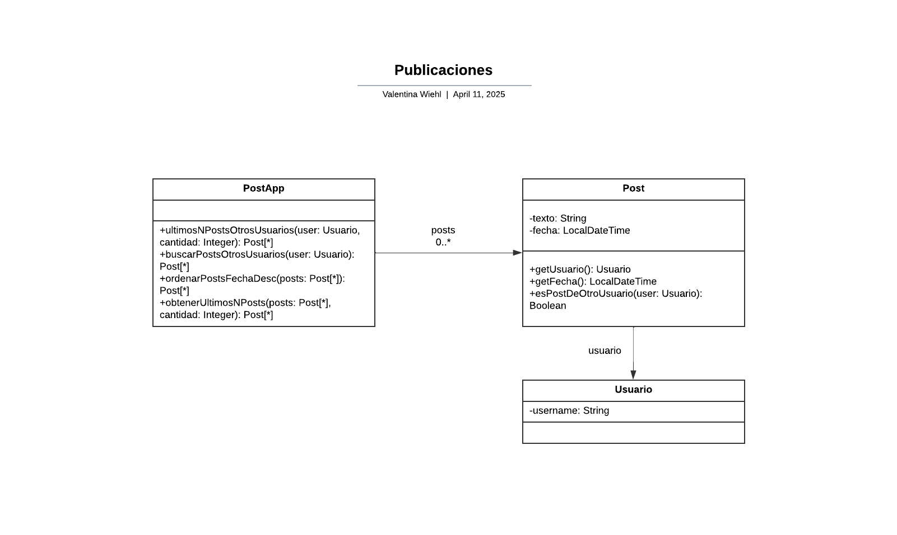

# 2.3 Publicaciones

~~~java
/**
* Retorna los últimos N posts que no pertenecen al usuario user
*/
public List<Post> ultimosPosts(Usuario user, int cantidad) {
        
    List<Post> postsOtrosUsuarios = new ArrayList<Post>();
    for (Post post : this.posts) {
        if (!post.getUsuario().equals(user)) {
            postsOtrosUsuarios.add(post);
        }
    }
        
   // ordena los posts por fecha
   for (int i = 0; i < postsOtrosUsuarios.size(); i++) {
       int masNuevo = i;
       for(int j= i +1; j < postsOtrosUsuarios.size(); j++) {
           if (postsOtrosUsuarios.get(j).getFecha().isAfter(
     postsOtrosUsuarios.get(masNuevo).getFecha())) {
              masNuevo = j;
           }    
       }
      Post unPost = postsOtrosUsuarios.set(i,postsOtrosUsuarios.get(masNuevo));
      postsOtrosUsuarios.set(masNuevo, unPost);    
   }
        
    List<Post> ultimosPosts = new ArrayList<Post>();
    int index = 0;
    Iterator<Post> postIterator = postsOtrosUsuarios.iterator();
    while (postIterator.hasNext() &&  index < cantidad) {
        ultimosPosts.add(postIterator.next());
    }
    return ultimosPosts;
}
~~~

<u><i>Code smells</i></u>  
   * Se pueden reemplazar las estructuras de control del código para hacer uso de streams.
  

<u><i>Refactoring</i></u>  
   * Replace Loop with Pipeline.
  

<i>Solución:</i> 
Aplico el uso de la herramienta streams para simplificar el código.

~~~java
/**
* Retorna los últimos N posts que no pertenecen al usuario user
*/
public List<Post> ultimosPosts(Usuario user, int cantidad) {
        
    List<Post> postsOtrosUsuarios = new ArrayList<Post>();
    postOtrosUsuarios = posts.stream()
    .filter(post -> !post.getUsuario().equals(user))
    .collect(Collectors.toList());
        
   // ordena los posts por fecha
   postOtrosUsuarios = posts.sorted((p1, p2) -> p1.getFecha().compareTo(p2.getFecha()))
    .collect(Collectors.toList());
        
    List<Post> ultimosPosts = new ArrayList<Post>();
    ultimosPosts = posts.stream()
    .limit(limite)
    .collect(Collectors.toList());
    return ultimosPosts;
}
~~~

<u><i>Code smells</i></u>  
   * Long Method. 
   * Nombre poco descriptivo.
  

<u><i>Refactoring</i></u>  
   * Extract Method.
   * Rename Method.
  

<i>Solución:</i> 
Aplico "Extract Method" para descomponer el método "ultimosPosts()" que es demasiado largo en métodos más pequeños que estén nombrados de manera adecuada, sean sencillos de leer y fáciles de modificar. También modifico el nombre del método original.

~~~java
/**
* Retorna los últimos N posts que no pertenecen al usuario user
*/
public List<Post> ultimosNPostsOtrosUsuarios(Usuario user, int cantidad) {     
    List<Post> postsOtrosUsuarios = buscarPostsOtrosUsuarios(user);
    postsOtrosUsuarios = ordenarPostsPorFechaDesc(postsOtrosUsuarios);
    return obtenerUltimosNPosts(postsOtrosUsuarios, cantidad); 
}

public List<Post> buscarPostsOtrosUsuarios(Usuario user) {
    return posts.stream()
    .filter(post -> !post.getUsuario().equals(user))
    .collect(Collectors.toList());
}

public List<Post> ordenarPostsFechaDesc(List<Post> posts) {
    return posts.sorted((p1, p2) -> p1.getFecha().compareTo(p2.getFecha()))
    .collect(Collectors.toList());
}

public List<Post> obtenerUltimosNPosts(List<Posts> posts, int limite) {
    return posts.stream()
    .limit(limite)
    .collect(Collectors.toList());
}
~~~

<u><i>Code smells</i></u>  
   * Data Class.
   * Feature Envy.
  

<u><i>Refactoring</i></u>  
   * Move Method.
  

<i>Solución:</i> 
Aplico el refactoring Move Method para asignar de manera correcta la responsabilidad de verificar que el usuario no sea dueño de un post. 

~~~java
public class PostApp {
    /**
    * Retorna los últimos N posts que no pertenecen al usuario user
    */
    public List<Post> ultimosNPostsOtrosUsuarios(Usuario user, int cantidad) {     
        List<Post> postsOtrosUsuarios = buscarPostsOtrosUsuarios(user);
        postsOtrosUsuarios = ordenarPostsPorFechaDesc(postsOtrosUsuarios);
        return obtenerUltimosNPosts(postsOtrosUsuarios, cantidad); 
    }

    public List<Post> buscarPostsOtrosUsuarios(Usuario user) {
        return posts.stream()
        .filter(post -> post.esPostDeOtroUsuario(user))
        .collect(Collectors.toList());
    }

    public List<Post> ordenarPostsFechaDesc(List<Post> posts) {
        return posts.sorted((p1, p2) -> p1.getFecha().compareTo(p2.getFecha()))
        .collect(Collectors.toList());
    }

    public List<Post> obtenerUltimosNPosts(List<Posts> posts, int limite) {
        return posts.stream()
        .limit(limite)
        .collect(Collectors.toList());
    }
}

public class Post {
    private String texto; 
    private LocalDateTime fecha; 
    private Usuario user; 

    public Usuario getUsuario() {
        return user; 
    }

    public LocalDateTime getFecha() {
        return fecha; 
    }

    public boolean esPostDeOtroUsuario(Usuario user) {
        return !this.user.equals(user);
    }
}
~~~

