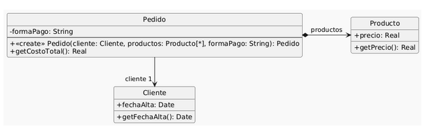

# Ejercicio 4 
Se tiene el siguiente modelo de un sistema de pedidos y la correspondiente implementación.

 

~~~java
public class Pedido {
    private Cliente cliente;
    private List<Producto> productos;
    private String formaPago;
    
    public Pedido(Cliente cliente, List<Producto> productos, String formaPago) {
        if (!"efectivo".equals(formaPago)
        && !"6 cuotas".equals(formaPago)
        && !"12 cuotas".equals(formaPago)) {
        throw new Error("Forma de pago incorrecta");
        }
        this.cliente = cliente;
        this.productos = productos;
        this.formaPago = formaPago;
    }

    public double getCostoTotal() {
        double costoProductos = 0;
        for (Producto producto : this.productos) {
            costoProductos += producto.getPrecio();
        }
        double extraFormaPago = 0;
        if ("efectivo".equals(this.formaPago)) {
            extraFormaPago = 0;
        } else if ("6 cuotas".equals(this.formaPago)) {
            extraFormaPago = costoProductos * 0.2;
        } else if ("12 cuotas".equals(this.formaPago)) {
            extraFormaPago = costoProductos * 0.5;
        }
        int añosDesdeFechaAlta = Period.between(this.cliente.getFechaAlta(), LocalDate.now()).getYears();
        // Aplicar descuento del 10% si el cliente tiene más de 5 años de antiguedad
        if (añosDesdeFechaAlta > 5) {
            return (costoProductos + extraFormaPago) * 0.9;
        }
        return costoProductos + extraFormaPago;
    }
}

public class Cliente {
    private LocalDate fechaAlta;
    
    public LocalDate getFechaAlta() {
        return this.fechaAlta;
    }
}

public class Producto {
    private double precio;
    
    public double getPrecio() {
    return this.precio;
    }
}
~~~

<i>Tareas:</i>
Dado e	l código anterior, aplique únicamente los siguientes refactoring: 
1. Replace Loop with Pipeline (líneas 16 a 19)  
2. Replace Conditional with Polymorphism (líneas 21 a 27)  
3. Extract Method y Move Method (línea 28)  
4. Extract Method y Replace Temp with Query (líneas 28 a 33)  

Realice el diagrama de clases del código refactorizado. 

## <i>Soluciones</i>

### Replace Loop with Pipeline

~~~java
public class Pedido {
    private Cliente cliente;
    private List<Producto> productos;
    private String formaPago;
    
    public Pedido(Cliente cliente, List<Producto> productos, String formaPago) {
        if (!"efectivo".equals(formaPago)
        && !"6 cuotas".equals(formaPago)
        && !"12 cuotas".equals(formaPago)) {
            throw new Error("Forma de pago incorrecta");
        }
        this.cliente = cliente;
        this.productos = productos;
        this.formaPago = formaPago;
    }

    public double getCostoTotal() {
        // Replace Loop with Pipeline
        double costoProductos = this.productos.stream()
        .mapToDouble(producto -> producto.getPrecio()).sum(); 
        double extraFormaPago = 0;
        if ("efectivo".equals(this.formaPago)) {
            extraFormaPago = 0;
        } else if ("6 cuotas".equals(this.formaPago)) {
            extraFormaPago = costoProductos * 0.2;
        } else if ("12 cuotas".equals(this.formaPago)) {
            extraFormaPago = costoProductos * 0.5;
        }
        int añosDesdeFechaAlta = Period.between(this.cliente.getFechaAlta(), LocalDate.now()).getYears();
        // Aplicar descuento del 10% si el cliente tiene más de 5 años de antiguedad
        if (añosDesdeFechaAlta > 5) {
            return (costoProductos + extraFormaPago) * 0.9;
        }
        return costoProductos + extraFormaPago;
    }
}

public interface FormaDePago {
    public double calcularMontoExtra(double costoProductos) {};
}

public class PagoEfectivo implements FormaDePago {
    public double calcularMontoExtra(double costoProductos) {
        return 0; 
    }
}

public class Pago6Cuotas implements FormaDePago {
    public double calcularMontoExtra(double costoProductos) {
        return costoProductos * 0.2;
    }
}

public class Pago12Cuotas implements FormaDePago {
    public double calcularMontoExtra(double costoProductos) {
        return costoProductos * 0.5;
    }
}

public class Cliente {
    private LocalDate fechaAlta;
    
    public LocalDate getFechaAlta() {
        return this.fechaAlta;
    }
}

public class Producto {
    private double precio;
    
    public double getPrecio() {
    return this.precio;
    }
}
~~~

### Replace Conditional with Polymorphism

~~~java
public class Pedido {
    private Cliente cliente;
    private List<Producto> productos;
    private FormaDePago formaPago;
    
    public Pedido(Cliente cliente, List<Producto> productos, FormaDePago formaPago) {
        // Replace Conditional with Polymorphism
        this.cliente = cliente;
        this.productos = productos;
        this.formaPago = formaPago;
    }

    public double getCostoTotal() {
        // Replace Loop with Pipeline
        double costoProductos = this.productos.stream()
        .mapToDouble(producto -> producto.getPrecio())
        .sum(); 
        // Replace Conditional with Polymorphism
        double extraFormaPago = this.formaPago.calcularMontoExtra(costoProductos); 
        int añosDesdeFechaAlta = Period.between(this.cliente.getFechaAlta(), LocalDate.now()).getYears();
        // Aplicar descuento del 10% si el cliente tiene más de 5 años de antiguedad
        if (añosDesdeFechaAlta > 5) {
            return (costoProductos + extraFormaPago) * 0.9;
        }
        return costoProductos + extraFormaPago;
    }
}

// Replace Conditional with Polymorphism
public interface FormaDePago {
    public double calcularMontoExtra(double costoProductos) {};
}

public class PagoEfectivo implements FormaDePago {
    public double calcularMontoExtra(double costoProductos) {
        return 0; 
    }
}

public class Pago6Cuotas implements FormaDePago {
    public double calcularMontoExtra(double costoProductos) {
        return costoProductos * 0.2;
    }
}

public class Pago12Cuotas implements FormaDePago {
    public double calcularMontoExtra(double costoProductos) {
        return costoProductos * 0.5;
    }
}

public class Cliente {
    private LocalDate fechaAlta;
    
    public LocalDate getFechaAlta() {
        return this.fechaAlta;
    }
}

public class Producto {
    private double precio;
    
    public double getPrecio() {
    return this.precio;
    }
}
~~~

### Extract Method & Move Method

~~~java
public class Pedido {
    private Cliente cliente;
    private List<Producto> productos;
    private FormaDePago formaPago;
    
    public Pedido(Cliente cliente, List<Producto> productos, FormaDePago formaPago) {
        // Replace Conditional with Polymorphism
        this.cliente = cliente;
        this.productos = productos;
        this.formaPago = formaPago;
    }

    public double getCostoTotal() {
        // Replace Loop with Pipeline
        double costoProductos = this.productos.stream()
        .mapToDouble(producto -> producto.getPrecio())
        .sum(); 
        // Replace Conditional with Polymorphism
        double extraFormaPago = this.formaPago.calcularMontoExtra(costoProductos); 
        // Extract Method & Move Method
        int añosDesdeFechaAlta = this.cliente.calcularAñosDeAntiguedad();
        // Aplicar descuento del 10% si el cliente tiene más de 5 años de antiguedad
        if (añosDesdeFechaAlta > 5) {
            return (costoProductos + extraFormaPago) * 0.9;
        }
        return costoProductos + extraFormaPago;
    }

    
}

// Replace Conditional with Polymorphism
public interface FormaDePago {
    public double calcularMontoExtra(double costoProductos) {};
}

public class PagoEfectivo implements FormaDePago {
    public double calcularMontoExtra(double costoProductos) {
        return 0; 
    }
}

public class Pago6Cuotas implements FormaDePago {
    public double calcularMontoExtra(double costoProductos) {
        return costoProductos * 0.2;
    }
}

public class Pago12Cuotas implements FormaDePago {
    public double calcularMontoExtra(double costoProductos) {
        return costoProductos * 0.5;
    }
}

public class Cliente {
    private LocalDate fechaAlta;
    
    public LocalDate getFechaAlta() {
        return this.fechaAlta;
    }

    // Extract Method & Move Method
    public int calcularAñosDeAntiguedad() {
        return Period.between(this.fechaAlta, LocalDate.now()).getYears();
    }
}

public class Producto {
    private double precio;
    
    public double getPrecio() {
    return this.precio;
    }
}
~~~

### Extract Method & Replace Temp with Query

~~~java
public class Pedido {
    private Cliente cliente;
    private List<Producto> productos;
    private FormaDePago formaPago;
    
    public Pedido(Cliente cliente, List<Producto> productos, FormaDePago formaPago) {
        // Replace Conditional with Polymorphism
        this.cliente = cliente;
        this.productos = productos;
        this.formaPago = formaPago;
    }

    public double getCostoTotal() {
        // Replace Loop with Pipeline
        double costoProductos = this.productos.stream()
        .mapToDouble(producto -> producto.getPrecio())
        .sum(); 
        // Replace Conditional with Polymorphism
        double extraFormaPago = this.formaPago.calcularMontoExtra(costoProductos); 
        // Extract Method & Move Method
        return this.calcularTotalConDescuento(costoProductos, extraFormaPago); 
    }

    // Extract Method y Replace Temp with Query
    public double calcularTotalConDescuento(double costoProductos, double extraFormaPago) {
        if (this.cliente.calcularAñosDeAntiguedad() > 5) {
            return (costoProductos + extraFormaPago) * 0.9;
        }
        return costoProductos + extraFormaPago;
    }
}

// Replace Conditional with Polymorphism
public interface FormaDePago {
    public double calcularMontoExtra(double costoProductos) {};
}

public class PagoEfectivo implements FormaDePago {
    public double calcularMontoExtra(double costoProductos) {
        return 0; 
    }
}

public class Pago6Cuotas implements FormaDePago {
    public double calcularMontoExtra(double costoProductos) {
        return costoProductos * 0.2;
    }
}

public class Pago12Cuotas implements FormaDePago {
    public double calcularMontoExtra(double costoProductos) {
        return costoProductos * 0.5;
    }
}

public class Cliente {
    private LocalDate fechaAlta;
    
    public LocalDate getFechaAlta() {
        return this.fechaAlta;
    }

    // Extract Method & Move Method
    public int calcularAñosDeAntiguedad() {
        return Period.between(this.fechaAlta, LocalDate.now()).getYears();
    }
}

public class Producto {
    private double precio;
    
    public double getPrecio() {
    return this.precio;
    }
}
~~~